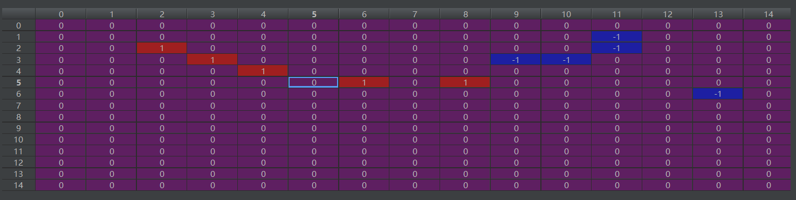
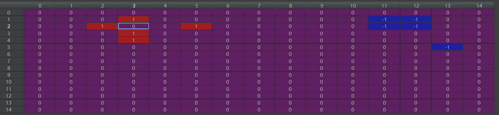

<h2 align = "center">Project 2 Report of</h2>
<h2 align = "center">CS303 Artificial intelligence</h2>
<h3 align = "center">Department of Computer Science and Engineering</h3>
<h2 align = "center">BY</h2>
<h2 align = "center">Junhao Liang</h2>
<h3 align = "center">11710911</h3>


<div STYLE="page-break-after: always;"></div>

## 1. Preliminaries

### 1.1 Problem Description

​	Gomoku is a popular board game, in its natural rules are very easy to start, simple and easy to learn. Based on the reference and analysis of the relevant literature of gomoku, this project realizes and optimizes some relevant algorithms, and finally obtains that the chess power and speed are better than the most students' projects.


### 1.2 Problem Application

​	As an important branch of artificial intelligence, computer game is also an index to test the development level of artificial intelligence. Machine game is considered to be one of the most challenging research directions in the field of artificial intelligence, and chess games are especially active in this field. In 1997, the *deep blue* super chess computer developed by IBM beat Kasparov, the world number one player in the ranking. The defeat of go, the last bastion of human intelligence, came in 2016 when Google's AlphaGo beat world champion and professional nine-dan player Lee Sedol.


### 1.3 Software & Hardware

​	This project is written in `Python(3.7.3)` with editor `Pycharm(Professional 2018.3)`. The local testing platform is `Windows 10 Professional Edition(1903)`， the remote testing platform is gomoku versus system.


### 1.4 Algorithms

​	First, I introduces game tree. For every game there are many kinds of moves. For instance of  15 by 15 chess board, when the black moves first, then there are 224 kinds of moves for the white. After selecting one of the 224 kinds of moves, the situation is moving from one state to another state, each state as a node. Then, the black has 253 moves in the lower level, as 253 nodes under his its parent node. In this way, all the situations are considered, and recurse down continuously, forming a huge game tree, also known as search tree. However, the time complexity of a complete gomoku game tree is $10^{70}$, space complexity is $10^{105}$ [[1]](#[1]L. Allis, *Searching for solutions in games and artificial intelligence*. Wageningen: Ponsen & Looijen, 1994.). Modern technology can't complete such calculations, so the complete game tree is not feasible, and we can only as deep as possible to search the shallow situation, as far as possible to avoid unnecessary searches to achieve an efficient search algorithm. This report will be from the gomoku rules, evaluation function design, basic search algorithm and optimization to elaborate. 

<div STYLE="page-break-after: always;"></div>

## 2. Methodology

### 2.1 Notation

- Term of gomoku:

  - ***five***: five pieces of the same color are linked together.
  - ***live four***: four pieces of the same color are linked together, and there are no pieces on either end.
  - ***jump four***: four pieces of the same color are linked together but an empty gap, and there are no pieces on either end.
  - ***two jumps four***: four pieces of the same color are linked together but two empty gaps, and there are no pieces on either end.
  - ***dead four***: four pieces of the same color are linked together, and there are one piece on one end.
  - ***live three***: three pieces of the same color are linked together, and there are no pieces on either end.
  - ***jump three***: three pieces of the same color are linked together but an empty gap, and there are no pieces on either end.
  - ***two jumps three***: three pieces of the same color are linked together but two empty gaps, and there are no pieces on either end.
  - ***dead three***: three pieces of the same color are linked together, and there are one piece on one end.
  - ***live two***: two pieces of the same color are linked together, and there are no piece on either end.
  - ***jump two***: two pieces of the same color are linked together but an empty gap, and there are no piece on either end.
  - ***dead two***: two pieces of the same color are linked together, and there are one piece on one end.

- ***COLOR_BLACK*** = -1

- ***COLOR_WHITE*** = 1

- ***COLOR_NONE*** = 0

- ***SCORE_MAX*** = $+\infin$

- ***SCORE_MIN*** = $-\infin$

- **Tool Funtions**:

  ***has_neighbor***(coord): judge if there is any neighbor around the coordinate.

  ***is_win***(move): determine if therer are any ***five*** near the move.


### 2.2 Data Structure

1. ***chessboard***: a numpy array 15 by 15, 1 means **white**, -1 means **black**, 0 means **none**
2. ***candidate_list***: store the candidate moves, and the last one is next move.
3. ***shape_score***: a tuple containing score and shape list, like `(200, (1, 0, 1, 0, 0))`.
4. ***score_all_array***: store the score shapes of one situation, used to calculate if there is a crossover score.
5. ***direction***: `[(0, 1), (1, 0), (1, 1), (-1, 1)]` convenient for calculating the scores of all four directions.
6. ***max_score_shape***: store the shape of one point in one direction with the max score, it is like `(1000,((1,0),(1,1),(1,2),(1,3),(1,4)),(1,0))`, which means in **(1,0)**  direction, we have five points **(1,0),(1,1),(1,2),(1,3),(1,4)** with score **1000**.


### 2.3 Model and Algorithms

#### 2.3.1 Evaluation Function

​	In order to realize the intelligence of computer player, we first have to  have a method to evaluate the analytic evaluation of a game situation. Here, we need to design a static evaluation function to score a situation. For any given situation, we need tp be able to evaluate the advantages and disadvantages of the situation. To make it numerical, we can give a score to the situation. The higher the score, the better for the computer. If the computer wins, the valuation is $+\infin$, if the computer loses, the valuation is $-\infin$.

​	Evaluation function is the basis of the whole game algorithm, and the quality of evaluation directly affects the intelligence of AI. However, the deeper the search tree, the more it can reduce the influence caused by the insufficient design of evaluation function.

​	This project adopts the chess type score sheet:


|  Score   |    Shape    |
| :------: | :---------: |
|   200    |  1 0 1 0 0  |
|   400    |  1 1 0 0 0  |
|   600    |  0 1 0 1 0  |
|   800    |  0 0 1 1 0  |
|   2500   |  1 1 0 1 0  |
|   2500   |  1 0 1 1 0  |
|   3000   |  1 1 1 0 0  |
|   4000   |  0 1 1 1 0  |
|   8000   |  1 1 1 0 1  |
|   8000   |  1 1 0 1 1  |
|  12000   |  1 1 1 1 0  |
| 99999999 |  1 1 1 1 1  |
|   3500   | 0 1 0 1 1 0 |
|   9000   | 1 1 1 0 1 0 |
|   9000   | 0 1 1 1 0 1 |
|  30000   | 0 1 1 1 1 0 |

> One means there is own chess here, zero means there is empty space, and the next step can be here. (The symmetrical shape is not shown.)

​	So the score that corresponds to a situation, which is the sum of scores of all the matches. The pseudo-code of evaluation function:

```pseudocode
FUNCTION evaluation(self, chessboard, color):
        # 算自己的得分
        score_all_arr <- []
        score_all_arr_enemy <- []
        my_score <- 0
        enemy_score <- 0
        direction <- [(0, 1), (1, 0), (1, 1), (-1, 1)]

        FUNCTION cal_score(m, n, x_direction, y_direction, curr_score_arr, color):

            # 在一个方向上， 只取最大的得分项
            max_score_shape = (0, None)

            # 如果此方向上，该点已经有得分形状,且得分大于1000，不重复计算.（小得分棋形重复计算，有利于形成双三）
            for shape in score_all_arr:
                IF shape.score > 1000 and (m, n) in shape.points and (x_direction, y_direction) = shape.direction:
                    return 0

            # 在落子点 左右方向上循环查找得分形状
            # 左右共11个子。长度为5的shape有7个，长度为6的shape有6个
            shape_5, shape_6 <- 11 points of (left five and right five):
            max_score_shape <- max(one of shape_5, one of shape_6)
            add_score = 0  # 加分项
		   for shape in curr_score_arr:
		   		if some point in shape = some point in max_score_shape
		   			# 如果两种棋形得分都大于2000，那么取最大的，否则取最小值，避免距离赢棋很远的棋形获得高分
                      if shape.score >= 2000 and max_score_shape.score >= 2000:
                      	add_score <- max(shape.score, max_score_shape.score)
                      else:
                        add_score <- min(shape.score, max_score_shape.score)
            # 计算两个形状相交，得分增加
		   curr_score_arr.append(max_score_shape)
            return add_score + max_score_shape.score
		
        # 遍历整个棋盘，得到总分值
        for (x,y) in chessboard:
           if (x,y) = my_color
              my_score <- sum(cal_my_score of four directions)
           elif (x,y) = enemy_color:
              enemy_score <- sum(cal_enemy_score of four directions)
	   # defence_factor为白时较高 为黑时较低。因为黑子更容易赢，所以需要更偏向于进攻
        total_score <- my_score - defence_factor * enemy_score
        return total_score
```

#### 2.3.2 Heuristic Search

​	Using the above code, we need to assume one of the available points to be the next move, and then calculate the situation score. Finally, the empty point with the highest score is selected as the next move. This approach requires traversing all the empty points and has very high complexity. Actually, we can do a rough assessment for every empty, sort them and just do evaluation function for several points with highest score, which is named as heuristic function. This project uses `empty point valuation score`. For a empty point, scanning the four directions to figure out the features of four directions, and then decide the chess types of it. According to these special types to grade the point. The corresponding scores are shown on the following table:


|      Shape      |  Score   |
| :-------------: | :------: |
|      five       | 10000000 |
|    live four    |  100000  |
|  one jump four  |  40000   |
| two jumps four  |  35000   |
|    dead four    |  35000   |
|   live three    |  35000   |
| one jump three  |   7000   |
| two jumps three |   5000   |
|   dead three    |   5000   |
|    live two     |   1000   |
|    jump two     |   700    |
|    dead two     |   500    |

​	When matching a pattern in the same direction, match from the top down in the table instead of accumulating points. The sum by scale of two sides the four direction is the score of the point:$\sum_{dir=0}^3{myScore} + factor*\sum_{dir=0}^3{enemyScore}$ .

​	When matching types in a direction, we need to detect 4 points in two sides, then according to the following indicators confirm chess type:

- number of own chess pieces: `color_number`
- number of blocks: `block`
- the gap of the sides: `left_gap`, `right_gap`
- the total gap: `gap`

The heuristic function code:

```python
def heuristic(chessboard):
        moves <- []
        direction <- [(0, 1), (1, 0), (1, 1), (-1, 1)]

        def cal(x, y, dir, my_color):
            line <- the color of four left points, four right points and itself
            color_number <- 1
            block <- 0
            left_gap, right_gap <- 0, 0
            gap <- 0
            for four points of one side:
                if point = my_color:
                	color_number += 1
                    if the prev point = None:
                        gap += 1
                elif point = None:
                    if the prev point = None:
                        break
                else:
                    block += 1
                    if the prev point = None:
                        left_gap += 1
                    break
			for four points of another side:
                same as above


            if color_number >= 5:
                if gap = 0:
                    return score of 'five'
                else:
                    return score of 'live_four'
                # 没有阻挡 或者有阻挡 但仍有足够的空位可以成5
            if block = 0 or (left_gap + right_gap + color_number + gap >= 5):
                if color_number = 4:  
                    if gap = 2:	# 跳2个活四
                        return score of 'jump_four_2'
                    elif gap = 1:	#跳1个活四
                        return score of 'jump_four'
                    else:	# 活四
                        return score of 'live_four_'
                elif color_number = 3:
                    if gap = 2:	# 跳2个活三
                        return score of 'jump_three_2'
                    elif gap = 1:	# 跳1个活三
                        return score of 'jump_three'
                    else:	# 活三
                        return score of 'live_three'
                elif color_number = 2:
                    if gap = 1:	#跳2
                        return score of 'jump_two'
                    elif gap = 0:	#活2
                        return score of 'live_two'
            elif block = 1:
                if color_number = 4:  # 死四
                    return score of 'dead_four'
                elif color_number = 3:	# 死三
                    return score of 'dead_three'
                elif color_number = 2:	# 死二
                    return score of 'dead_two'
            return 0

        for move in self.empty_list:
            if move has no neighbor:
                continue
            my_score = 0
            enemy_score = 0
            for i in range(4):
                my_score += cal(move[0], move[1], direction[i], color)
                enemy_score += cal(move[0], move[1], direction[i], -color)
            # 计算当前子得分
            moves.append((my_score + 0.7 * enemy_score, move))
        #对所有子排序 返回指定数量search_breadth的点
        return the first several items of moves
```

​	After applying the heuristic function above, we just need to judge several situations using evaluation function, which greatly reduces the complexity of the algorithm.

#### 2.3.3 Minimax with Alpha Beta Pruning

​	We has introduced the concept of the game tree before, and the whole process of chess is from root node of the game tree going down a path. When come to the leaf node, which implies we have already played a chess game. We need to let the path as far as possible close to the leaf node of our victory, while the other side is trying to stop. But both modern technology and human can not see all the ends of the game tree leaf nodes in the first place, so that we can only reduce the depth of the game tree and the number of child nodes.

##### Minimax

​	Given a game tree, the best strategy can be decided by checking the `MINIMAX` value for each node. In general games, the **maximin value** of a player is the highest value that the player can be sure to get without knowing the actions of the other players; equivalently, it is the lowest value the other players can force the player to receive when they know the player's action. Its formal definition is:[[2]](#[2]M. Maschler, E. Solan, Z. Hellman, M. Borns and S. Zamir, *Game theory*. Cambridge: Cambridge University Press, 2018, pp. 176–180.)

$$v_i = max_{a_i}min_{a_{-i}}v_i(a_i,a_{-i})$$

where:

- $i$ is the index of the player of interest.
- $-i$ denotes another player.
- $a_i$ is the action taken by player $i$.
- $a_{-i}$ denotes the actions taken another player.
- $v_i$ is the evaluation function of player $i$.

​	Calculating the maximin value of a player is done in a worst-case approach: for each possible action of the player, we check all possible actions of another player and determine the worst possible action—the one that gives player $i$ the smallest value. Then, we determine which action player $i$ can take in order to make sure that this smallest value is the highest possible.

##### Alpha Beta Pruning

###### Core idea

​	This algorithm maintains two values, alpha and beta, which represent the minimum score that the maximizing player is assured of and the maximum score that the minimizing player is assured of respectively. Initially, alpha is negative infinity and beta is positive infinity, i.e. both players start with their worst possible score. Whenever the maximum score that the minimizing player (i.e. the "beta" player) is assured of becomes less than the minimum score that the maximizing player (i.e., the "alpha" player) is assured of (i.e. beta ≤ alpha), the maximizing player need not consider further descendants of this node, as they will never be reached in the actual play.[[3]](#[3]"Alpha–beta pruning", *En.wikipedia.org*, 2019. [Online]. Available: https://en.wikipedia.org/wiki/Alpha–beta_pruning. [Accessed: 07- Oct- 2019].)

###### The code:

```python
def alpha_beta(depth, chessboard, alpha, beta, color):
        if depth = 0 or no empty point left:
            return evaluation(chessboard, color)

        moves <- self.heuristic(chessboard, color)
        # if there are no moves, just return the score

        for point in moves:
            do the move
            if anyone wins:
                score <- -evaluation(chessboard, -color)
            else:
                score <- -alpha_beta(depth - 1, chessboard, -beta, -alpha, -color)
            undo the move

            # alpha/beta pruning
            if score > alpha:
                if depth = self.max_depth:
                    candidate_list.append((x, y))
                if score >= beta:
                    return beta
                alpha <- score

        return alpha
```

<div STYLE="page-break-after: always;"></div>

## 3. Empirical Verification

### 3.1 Dataset

​	The dataset of this project is mainly several testcases and the game of chess with the AI of other students. 

#### Testcase

​	For testcases, I used the code given by instructor and one of mine. My program finally passed all testcases.

##### Usability test:

- ​	all empty points case:
- one empty point case:


##### Simple test:

> The blue represents itself, the red represents the enemy, purple represents the empty. Next move has been circled. 

1. ​	
2. 
3. 
4. 
5. 
6. 

####  The points race

​	Based on the Gomoku platform, I let my program play a game of chess with other students'program to improve the chess power of my program.

​	 Initially, my program just used evaluation function to judge every empty points. In this way, it cost a lot time and can not generate a good enough move. However, at the beginning, everyone used only basic search, my program still has competitiveness, the highest ranking is the $\bf{2^{nd}}$.

​	Then, some students ajusted the program and gave me a score **close to zero**. So I tried to write a search tree algorithm, when I was done, I got to about **130 points**.

​	At last, the program was basically complete, all I could do is adjusting the parameters. Finally, I won the $\bf{6^{th}}$ place. Actually, even though my roommates, it's hard to beat it.


### 3.2 Performance measure

In This project, I mainly used three performance measures.

1. The usability test including some simple compositions.
2. The running time of one move. 
3. The rank of the points race and the round robin. 


### 3.3 Hyperparameters

In this project, I have the following hyperparameters:

- **score of shape:**

  Every special shape would have a corresponding score, this is the most crucial hyperparameter.

- **search depth:**

  The depth of search tree. This parameter is always changing. Initially, due to the poor efficiency of my program, I just set it to **4**. Then, I optimized my program, it come to **6** even **7**. The deeper depth brings stronger chess power.

- **search breadth:**

  At the first, I set this parameter to **6 to 8**, so that my program run too slowly. Actually, when I optimized the heuristic function, it just needed to be **2**, which greatly reduced running time.

- **defence factor:**

  The factor of enemy scores. The higher the value, the higher the enemy score. After a lot of experiments, I set it to **1** as the **black**, to **1.3** as the **white**.


### 3.4 Experimental results

1. My program passed all the test cases in the usability test.
2. It was about **1-2** seconds, even the worst case, it didn't exceed **3** seconds. I think it is better than most students' program.
3. The rank of the points race is $\bf{6^{th}}$, the rank of the round robin is $\bf{6^{th}}$, too. However, I kept the $\bf{1^{st}}$ place for one hour once.


### 3.5 Conclusion

#### Tradeoff

Dumb and fast or smart and slow? If I get rid of a lot of situation evaluation function in the program, and increase the 	depth. It will perform better than the original program. 

#### Deficiencies

##### 	Lack of Robustness

​		My program can beat the students with higher rank every time I adjust the parameters, but it may lose to the students 		with lower rank. This proves that my code is not robust enough.

#### 	Instability

​		Sometimes, my program would neglect the ***dead four*** of enemy, but to form itself ***live four*** or other shape that can't be 		won straghtway. This would cause the failure of the game of chess. I think it is hard to avoid, only to consider the key 		situation separately.

#### Improvement 

##### 	Machine Learning

​	Neural Networks can invent some evaluation model, and don't need someone to tell it, it can make evaluation on the situation. The neural network is trained when it is told about the scoring situation, and it learns by itself when combined with genetic algorithms. This was used in AlphaGo, which proved it is very effective.	

<div STYLE="page-break-after: always;"></div>

## Reference

###### [1]L. Allis, *Searching for solutions in games and artificial intelligence*. Wageningen: Ponsen & Looijen, 1994.

###### [2]M. Maschler, E. Solan, Z. Hellman, M. Borns and S. Zamir, *Game theory*. Cambridge: Cambridge University Press, 2018, pp. 176–180.

###### [3]"Alpha–beta pruning", *En.wikipedia.org*, 2019. [Online]. Available: https://en.wikipedia.org/wiki/Alpha–beta_pruning. [Accessed: 07- Oct- 2019].